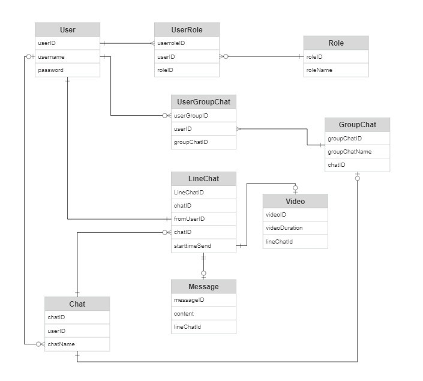

# Ứng dụng Chat với tính năng xem chung video
# Thành Viên
Lương Nhật Tuấn - B20DCCN615
Nguyễn Thu Thảo - B20DCCN655
Lê Xuân Thành - B20DCCN647
## Mô tả

Ứng dụng Chat với tính năng xem chung video là một ứng dụng giao tiếp đa phương tiện mạnh mẽ cho phép người dùng trò chuyện và xem video cùng nhau từ xa. Ứng dụng này kết hợp tính năng trò chuyện với khả năng xem cùng video từ trình phát video tích hợp. Điều này tạo ra trải nghiệm gần giống như việc bạn và bạn bè cùng xem một bộ phim trực tiếp.

## ERD

## Tính năng chính

- Trò chuyện văn bản: Người dùng có thể trò chuyện văn bản với nhau, gửi tin nhắn.
- Xem video cùng nhau: Một trong những tính năng độc đáo của ứng dụng này là khả năng xem video cùng nhau. Bất kỳ người dùng nào trong phòng trò chuyện có thể chia sẻ video từ file hoặc camera và tất cả thành viên khác trong phòng sẽ xem video đó cùng một lúc.
- Tạo và quản lý phòng: Người dùng có thể tạo phòng trò chuyện mới hoặc tham gia vào các phòng có sẵn. Họ có thể quản lý thành viên và quyền truy cập trong phòng.

## Hướng dẫn sử dụng

1. Đăng nhập hoặc đăng ký tài khoản.
2. Tạo phòng trò chuyện mới hoặc tham gia vào một phòng đã tồn tại.
3. Bắt đầu trò chuyện văn bản và mở video cùng nhau bằng cách chia sẻ video của bạn.

## Tool sử dụng
1. Java
2. Swing
## Tính năng bổ sung từ giảng viên

